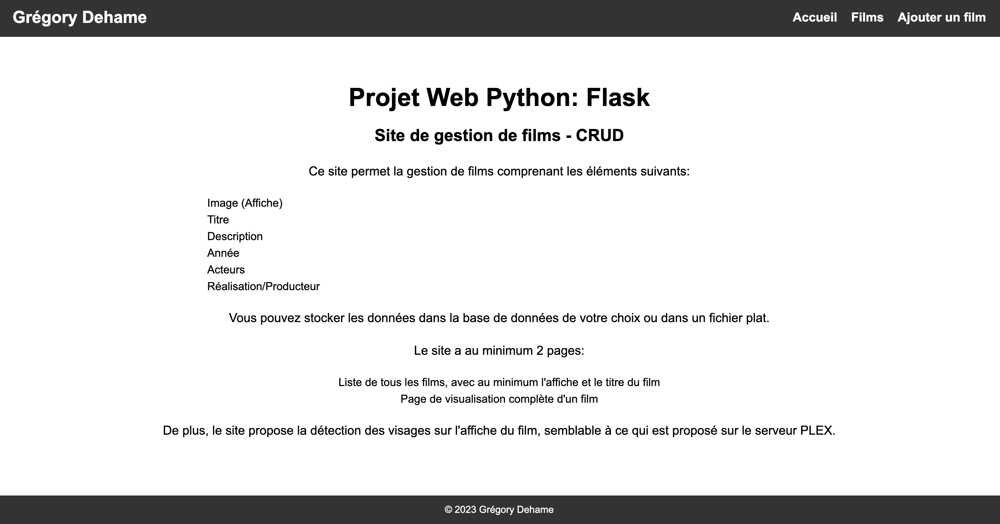
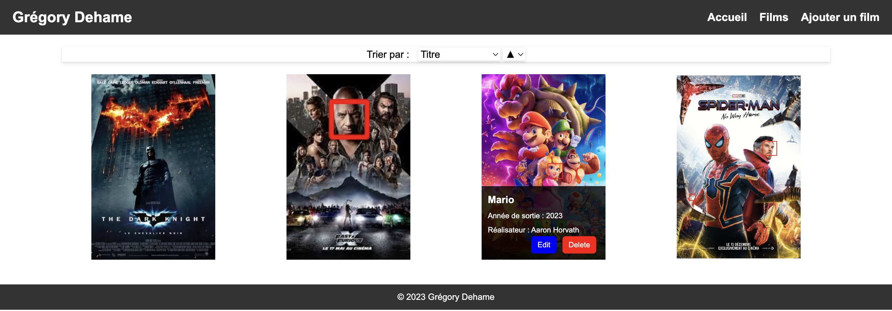
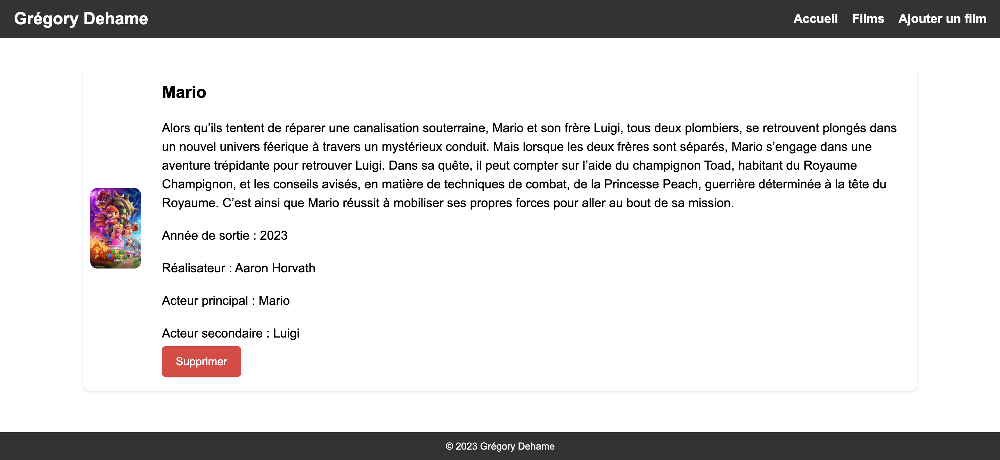
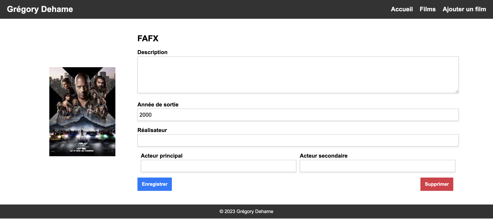
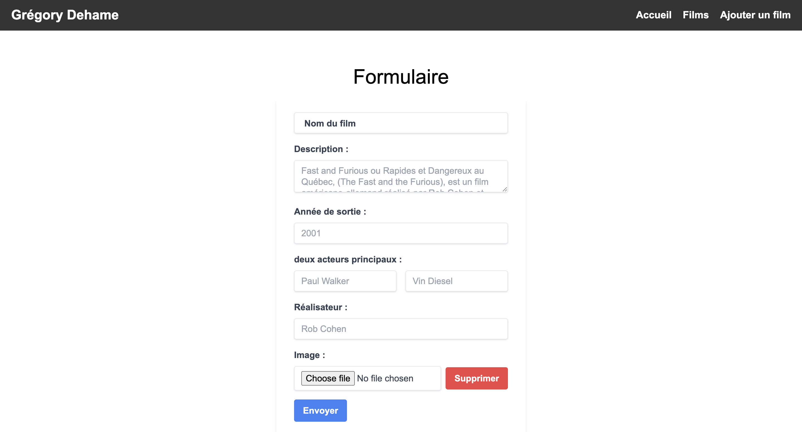

# Gestionnaire de Films – Projet Web Python Flask

## 📽️ Description

Ce site web a été développé dans le cadre d’un projet universitaire en Licence Professionnelle Réseaux et Génie Informatique.  
L’objectif était de concevoir une application de gestion de films en Python avec Flask, intégrant toutes les fonctionnalités essentielles d’un CRUD (Create, Read, Update, Delete).

L’utilisateur peut ainsi gérer une collection de films, chaque fiche comprenant :
- une affiche (image),
- un titre,
- une description,
- une année de sortie,
- la liste des acteurs,
- le réalisateur ou producteur.

Les données peuvent être stockées dans la base de données de votre choix ou dans un fichier plat, selon les besoins.

L’application propose au minimum deux pages principales :
- une page listant tous les films, affichant au moins l’affiche et le titre de chaque film,
- une page de visualisation détaillée pour chaque film.

Pour aller plus loin, une fonctionnalité avancée de détection automatique des visages sur les affiches de films a été intégrée, s’inspirant de ce que propose le serveur multimédia PLEX. Cette dimension technique met en avant la capacité à combiner développement web et traitement d’image dans un projet complet et moderne.

---

Ce projet répond à ces exigences en proposant une application web développée avec **Flask**.  
Il permet d’ajouter, de modifier, de visualiser et de supprimer des films dans une base de données SQLite.  
Chaque film possède une affiche, un titre, une description, une année de sortie, des acteurs principaux et secondaires, ainsi qu’un réalisateur ou producteur.  
Une fonctionnalité avancée de détection de visages sur les affiches (via OpenCV) est intégrée, inspirée de ce que propose le serveur PLEX.

---

## 🏗️ Contexte et Objectifs

Ce projet a été réalisé dans le cadre d’une Licence Professionnelle Réseaux et Génie Informatique, avec pour ambition de mettre en pratique les compétences acquises en développement web et en gestion de bases de données.  
L’objectif principal était de concevoir une application complète de gestion de films, en respectant les standards professionnels du développement Python et en intégrant des fonctionnalités avancées de traitement d’image.

- **Mise en œuvre concrète du framework Flask** et structuration modulaire de l’application (blueprints).
- **Gestion efficace des fichiers** (upload, stockage et affichage des affiches de films).
- **Intégration d’une base de données relationnelle** (SQLite) pour la persistance des données.
- **Ajout d’une dimension technique avec la détection de visages** sur les affiches (OpenCV), pour enrichir l’expérience utilisateur et démontrer la capacité à combiner web et traitement d’image.
- **Conception d’une interface moderne et responsive** grâce à Tailwind CSS, pour garantir une expérience utilisateur optimale sur tous supports.
- **Respect des bonnes pratiques de développement** : séparation des responsabilités, sécurité, validation des données et extensibilité du code.

Ce projet illustre ainsi la capacité à mener à bien un développement web complet, de la conception à la mise en production, tout en intégrant des aspects innovants et professionnels.

---

## 🖼️ Captures d'écran

### Page d'accueil


### Liste des films
Au survol de l’affiche, des boutons permettent de modifier ou supprimer un film. Un aperçu de l’année de sortie, du réalisateur ainsi que des deux acteurs principaux (si renseignés) est également affiché.


### Détail d'un film
Pour accéder aux détails d’un film, il suffit de cliquer sur son affiche.


### Modifier un film
Lors du survol de la fiche d’un film dans l’onglet « Films », un bouton « Edit » apparaît. Cliquez dessus pour accéder à la page de modification.


### Ajouter un film
Pour ajouter un film, cliquez sur l’onglet « Ajouter un film » présent dans l’en-tête du site.



---

## 🚀 Lancer le projet

### 1. Prérequis

- **Python** ≥ 3.10
- **pip** ou **poetry** pour la gestion des dépendances

### 2. Installation des dépendances

Installer **Poetry** :
```sh
pip install poetry
```

Ensuite :
```sh
poetry install --no-root
```

### 3. Initialisation de la base de données

La base de données SQLite sera automatiquement créée au premier lancement grâce à la fonction [`sql.init()`](sql.py).

### 4. Lancement de l'application

Sous Windows :
```sh
run.bat
```
Ou manuellement :
```sh
poetry run flask --debug run
```
L’application sera accessible sur [http://127.0.0.1:5000](http://127.0.0.1:5000).

---

## 🛠️ Technologies et outils

- **Python** 3.10+
- **Flask** (micro-framework web)
- **OpenCV** (détection de visages sur les affiches)
- **SQLite** (base de données embarquée)
- **Tailwind CSS** (CDN) pour le style
- **HTML/Jinja2** (templates)
- **JavaScript** (aperçu dynamique des images)
- **Poetry** ou **pip** pour la gestion des dépendances

---

## 📁 Structure du projet

- `app.py` : point d’entrée Flask
- `blueprints/films.py` : routes principales (CRUD)
- `sql.py` : accès à la base de données
- `helper.py` : détection de visages sur les affiches
- `static/` : fichiers statiques (CSS, affiches)
- `templates/` : templates Jinja2 (pages HTML)
- `base_de_donnees.db` : base SQLite (générée automatiquement)

---

## 💡 Fonctionnalités clés

- **CRUD complet** sur les films
- **Upload et gestion des affiches** (images)
- **Détection automatique des visages** sur les affiches (OpenCV)
- **Tri dynamique** des films (titre, année)
- **Interface responsive** et moderne
- **Gestion des erreurs** (404 personnalisée)
- **Séparation claire du code** (blueprints, helpers, SQL)

---

## 🔍 Points d'intérêt

- **Utilisation avancée de Flask** : blueprints, gestion des templates, gestion des fichiers uploadés.
- **Traitement d’image** : intégration d’OpenCV pour la détection de visages.
- **Sécurité** : gestion des extensions de fichiers uploadés, validation des formulaires.
- **Expérience utilisateur** : aperçu dynamique des images, interface claire et responsive.
- **Qualité du code** : séparation des responsabilités, code commenté, respect des bonnes pratiques Python.
- **Extensibilité** : architecture facilement adaptable pour d’autres types de médias ou fonctionnalités.

---

## 👤 Auteur

Grégory Dehame  
[LinkedIn](https://www.linkedin.com/gregory-dehame)  
[Site internet](https://gregorydhm.fr/)
